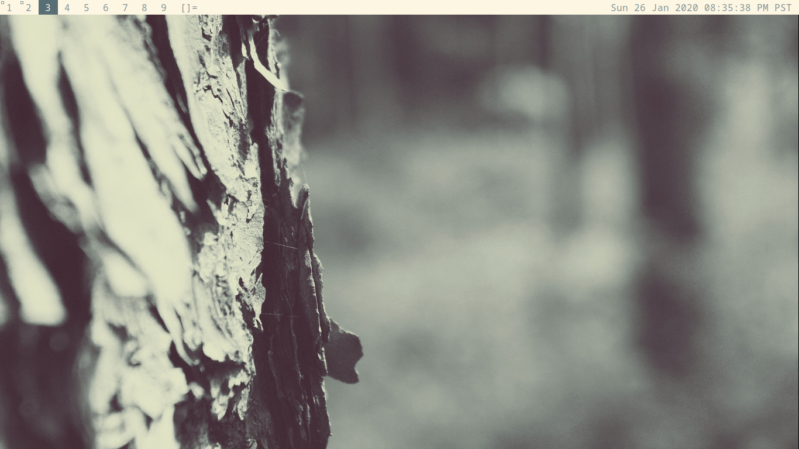
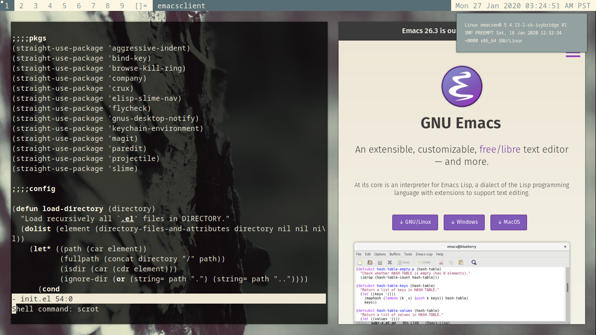

# Dotfiles





```bash
fscrypt encrypt ~/LOCKER
mv ~/.config/chromium ~/LOCKER
ln -s ~/LOCKER/chromium ~/.config

git clone git@github.com:a-schaefers/dotfiles.git
cd ~/dotfiles
cp -r $USBSTICK/{ssh,gpg} ~/dotfiles

mkdir -p ~/{bin,.emacs.d/straight/versions,.config/{mpv,spm,dunst}}
stow bin bash config emacs misc wallpaper ssh gnupg

cd ~/dotfiles/suckless-desktop/dwm/ && ./build
cd ~/dotfiles/suckless-desktop/dmenu && ./build
cd ~/dotfiles/suckless-desktop/st && ./build
```
