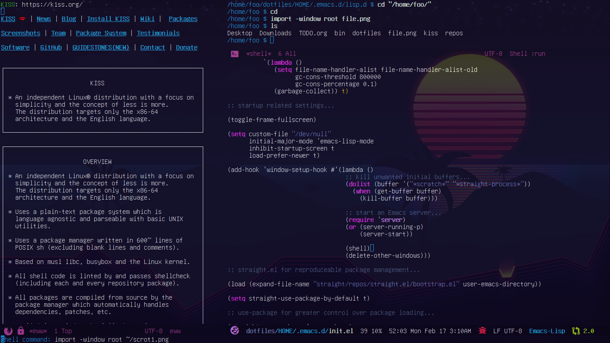

# [mostly] About Emacs

Productivity Principles:

- Don't interrupt my flow.

If Emacs does something to interrupt flow, I turn it off. This does not apply only to Emacs. I use Emacs and Linux mainly because it allows me to configure my development environment in a way that keeps me in the flow as much as possible. This includes modeline garbage from erc or company-mode completion popups, they are all turned off. "Spell check" is also turned off because I studied English and typing in school, and do not appreciate the often unhelpful distractions of "Spell Check." Likewise "linting" is not always-on for the same reason. I don't want to be surprised by anything on my screen. This includes desktop notifications, cell-phone rings and social media beeps.

- Left Control and Left Alt are swapped everywhere.

Old keyboards from back in the day were actually designed with control closer to the space bar. With this simple swap, one can press Left Control with one's left thumb; likewise Right Alt may be pressed with the right thumb-- ensuring proper ergonomics whilst using modifiers (goodbye "Emacs pinky!") and rendering modal editing mostly unnecessary

- If Emacs loads in more than 1 second, it is bloated

AND/OR poorly configured...

- Use Emacs built-ins instead of packages when possible.

For example,

Use completion-at-point informed by an lsp server or just simple hippie-expand instead of company-mode.

Use flymake (informed by an lsp server) instead of flycheck.

Prefer xref-find-definitions (informed by an lsp server) instead of dumb-jump or something similar.

- Use simple Elisp and don't turn on stuff / change defaults if unsure about what it does.

- Always follow security best practices:

Basically follow this https://wiki.archlinux.org/index.php/Security guide, but also some other common sense things, namely the following:

GPG keys and signatures. (Web of trust!)

SSH keys.

Passphrases and agents.

Disk/directory/file/transfer encryption.

Checksum checking.

Keep systems up-to-date using the latest of upstream software packages (these updates contain security fixes and this approach is simpler than backporting and patching old versions of software.)

Do source code audits. Don't just run scripts without viewing them. One reason I use KISS (https://k1ss.org) Linux is I am able to audit the entire system single-handedly. How many distros can you do this on?

When writing code, always sanity check your input and your variables, etc.

Use less software and services instead of more.

Monitor system behavior by keeping an eye on processes, services, logs, network traffic, iptables rules, filesystem permissions, etc. If neccessary inspect running processes using tools like gdb and strace. Doing this stuff is actually a lot of fun.

For obvious reasons, only use open source software.

## Replicate
```bash
git clone --recursive git@github.com:a-schaefers/dotfiles.git

mkdir -p ~/{bin,.emacs.d/straight/{versions,repos},.config/mpv}

cd ~/dotfiles && HOME/bin/stow HOME
```




